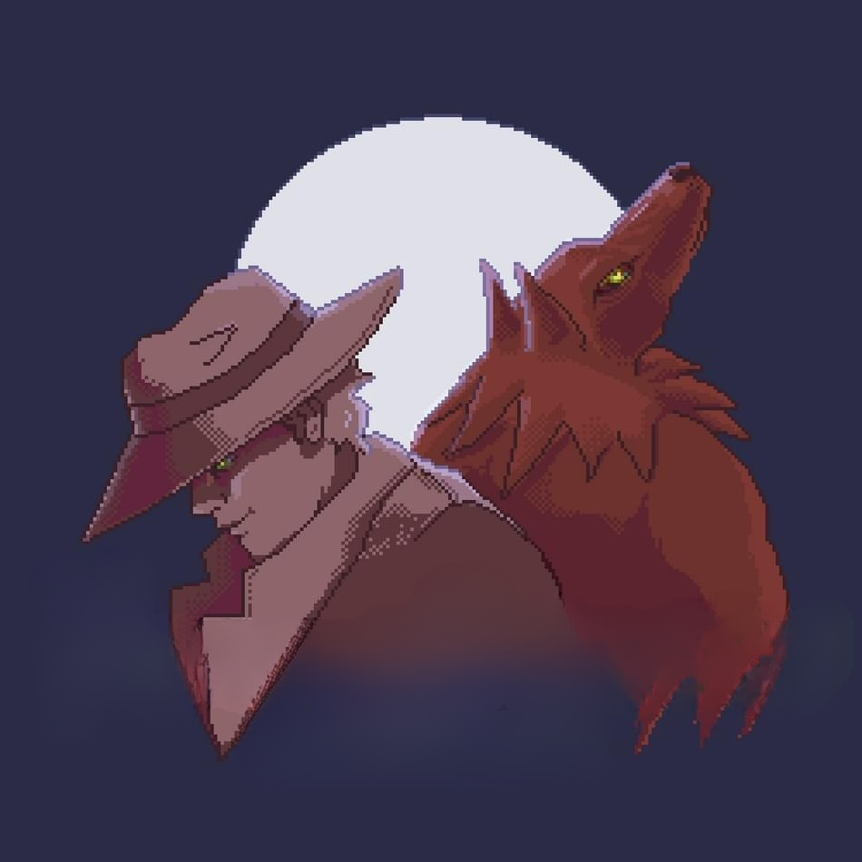

<h1 align="center">
Discord Submission Validator BOT
</h1>

A discord bot for validating participants submission on discord contests.

## Built using NODEJS :heart:

---

## Requirements 🎓

For development, you will only need Node.js and a node global package, Yarn, installed in your environement.

### Node

- #### Node installation on Windows

  Just go on [official Node.js website](https://nodejs.org/) and download the installer.
  Also, be sure to have `git` available in your PATH, `npm` might need it (You can find git [here](https://git-scm.com/)).

- #### Node installation on Ubuntu

  You can install nodejs and npm easily with apt install, just run the following commands.

      $ sudo apt install nodejs
      $ sudo apt install npm

- #### Other Operating Systems
  You can find more information about the installation on the [official Node.js website](https://nodejs.org/) and the [official NPM website](https://npmjs.org/).

If the installation was successful, you should be able to run the following command.

    $ node --version
    v8.11.3

    $ npm --version
    6.1.0

If you need to update `npm`, you can make it using `npm`! Cool right? After running the following command, just open again the command line and be happy.

    $ npm install npm -g

###

### Yarn installation

After installing node, this project will need yarn too, so just run the following command.

      $ npm install -g yarn

---

## Fork this repo for contribution 🦾

    Fork this repo in your local github account.

#### Run these commands after fork

    $ git clone https://github.com/<YOUR_USERNAME>/Wolfrine_Discord_Bot.git
    $ cd Wolfrine_Discord_Bot
    $ yarn install

#### Set upstream for PR

    $ git remote add upstream https://github.com/Mithilesh-create/Wolfrine_Discord_Bot.git

## Install 💻

    $ git clone https://github.com/Mithilesh-create/Wolfrine_Discord_Bot.git
    $ cd Wolfrine_Discord_Bot
    $ yarn install

## Configure app 🛠

Create `.env` file with `.env_example` parameters then edit it with your settings. You will need:

- Discord Server ID `GUILD_ID`
- Discord bot ID `CLIENT_ID`
- Discord bot secret token ID `TOKEN`

#### checkout .env.example file for more info

## Running the project

    $ yarn start

## Simple build for production

    $ yarn build

# Discord Commands with params

## Moderator of server

### Register new event in channel
    /register-event
        Event-Title
        Start-Date
        End-Date
        No-of-Submissions
        Secret-Key

### Register new task in channel
    /register-task
        Task-Title
        Secret-Key

### Get Registered users
    /getdata
        Secret-Key

### Get Completed users
    /getcompleted
        Secret-Key

### Close Event
    /close-event
        Secret-Key

## Participant in event (USER)

### Register to active event in channel
    /register
        

### Submit daily task in channel
    /daily-task
        task-url
        post-url

# NOTE !!!!!!!
### Time peroid of eligibility of user

    If `task 1` is added by moderator then the user has to complete the task before :

        1. Moderator adds another task i.e. in this case `task 2`
        2. Moderator closes the event by `/close-event` command.

    If user submits daily task before this then the user considers as eligible.

